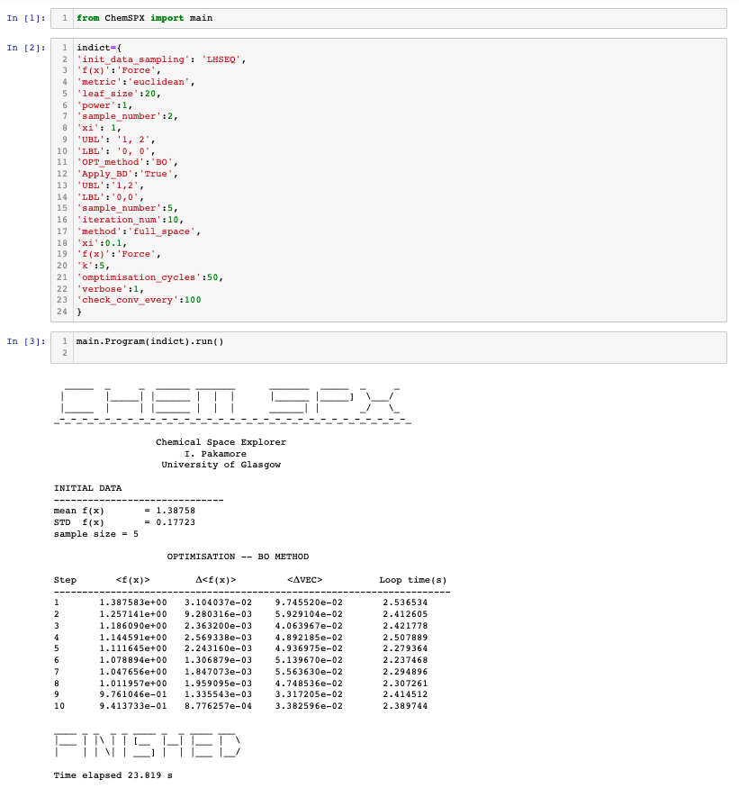

# ChemSPX (Chemical Space Explorer)

Code for sampling and analysing reaction parameter space. 

## Setup
To install ChemSPX type:
```
$ python3 setup.py install
```
## Execution

```
$ python3 run.py input.txt
```

Input file example:

```
#######################################################
#                INPUT  FILE  FOR                     #
#                   ChemSPX                           #
#######################################################


in_file 2d_samples.csv
out_dir force
print_every 1
write_initial False

init_data_sampling void
OPT_method BO
omptimisation_cycles 150

random_seed 1
Apply_BD True 

UBL 1, 1
LBL 0, 0

iteration_num 0
r 0.5

optimisation_cycles 7
conv_thr 8e-20
sample_number 2

conv_fx 1
conv_del_fx 1e-7
conv_vec 1e-1
check_conv_every 100
method full_space
xi 0.01
GRID_sample_number 100
ini_pop_size 100
pop_size 100
n_processes 1


#BALL TREE input parameters
f(x) Force
power 1
k 6
```
In Jupyter environment:


